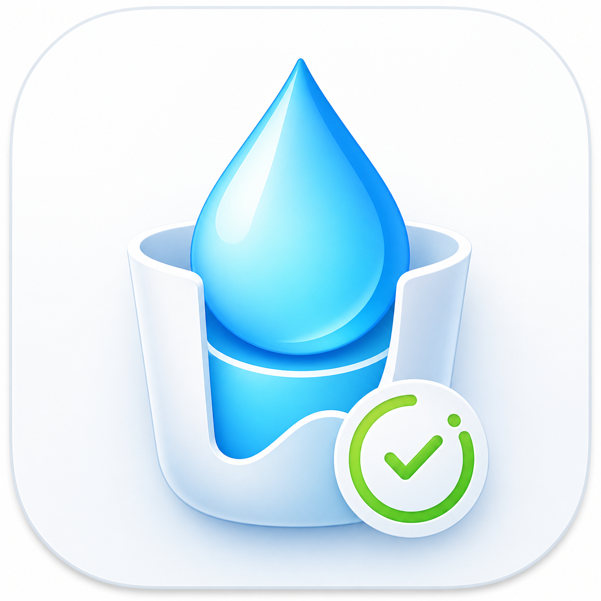

# DrinkMore 中文说明

[Back to English README](README.md)



DrinkMore 是一个开源 macOS 喝水提醒工具。它常驻菜单栏，可以记录真实杯子的容量，统计每天喝了多少水、咖啡、茶或其他饮品，并支持通知提醒和全屏强提醒。

## 当前功能

- 新增和编辑杯子，包括名称、类型、容量。
- 从主窗口或菜单栏快速记录饮品。
- 统计今天喝了多少杯、总共摄入多少 ml。
- 自定义倒计时提醒。
- 先发系统通知，超过宽限时间后弹出全屏提醒。
- 自定义水、咖啡、茶或其他饮品的成就目标。
- App 界面支持英文和中文切换。
- 页面切换带动画。

## 本地运行

```bash
swift run DrinkMore
```

第一次运行时，系统会请求通知权限。

## 打包 Release

```bash
./Scripts/package-release.sh
```

脚本会生成：

- `dist/DrinkMore.app`
- `dist/DrinkMore-macOS.zip`

把 zip 上传到 GitHub Release，用户下载后解压并打开 `DrinkMore.app`。

## macOS 通知说明

macOS 没有给普通 App 一个稳定接口来判断用户是否“消掉”了通知。DrinkMore 采用更可靠的交互判断：通知发出后，如果你没有在 App、菜单栏或全屏页点击“已处理”“稍后”、记录饮品，到达宽限时间就会弹全屏提醒。
